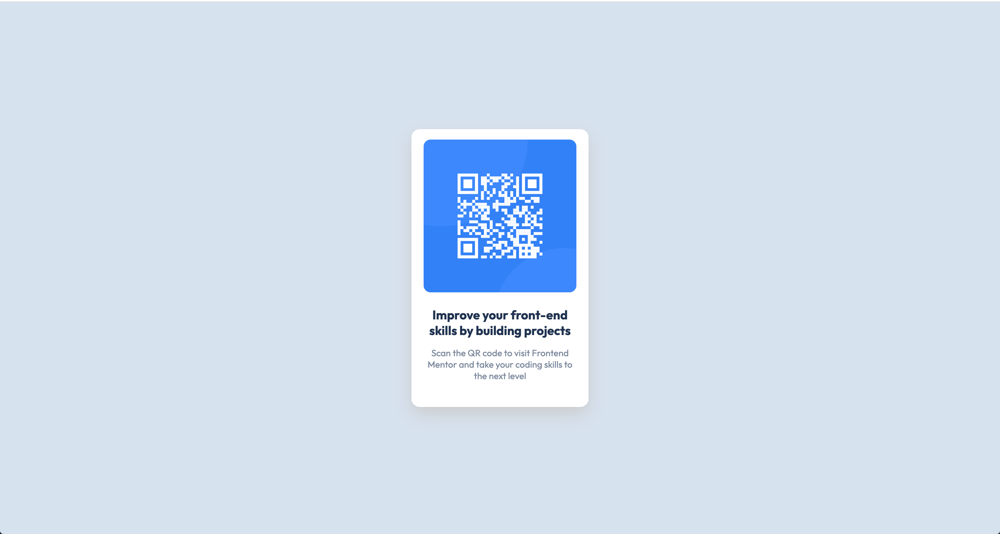

# Frontend Mentor - QR code component solution

This is a solution to the [QR code component challenge on Frontend Mentor](https://www.frontendmentor.io/challenges/qr-code-component-iux_sIO_H). Frontend Mentor challenges help you improve your coding skills by building realistic projects. 

## Table of contents

- [Overview](#overview)
  - [Screenshot](#screenshot)
  - [Links](#links)
- [My process](#my-process)
  - [Built with](#built-with)
  - [What I learned](#what-i-learned)
  - [Continued development](#continued-development)

**Note: Delete this note and update the table of contents based on what sections you keep.**

## Overview

### Screenshot



### Links

- Coming soon

## My process

As this is my first challenge on Frontend Mentor, I chose to use plain HTML and CSS. It also didn't make sense to use any frameworks, as the challenge was very simple, and I didn't want to overcomplicate it.

### Built with

- Semantic HTML5 markup
- CSS custom properties
- Flexbox

### What I learned

One of the most important things that I learned in this challenge, was how to center a div on a page in CSS. Using the CSS Flexbox, and setting the height to 100vh, I was able to center it perfectly in the middle. 

```css
.center-div {
    display: flex;
    justify-content: center;
    align-items: center;
    height: 100vh;
}
```

### Continued development

From here, I would like to improve my general HTML/CSS skills, as well as using Bootstrap and/or Tailwind to speed up the process.
